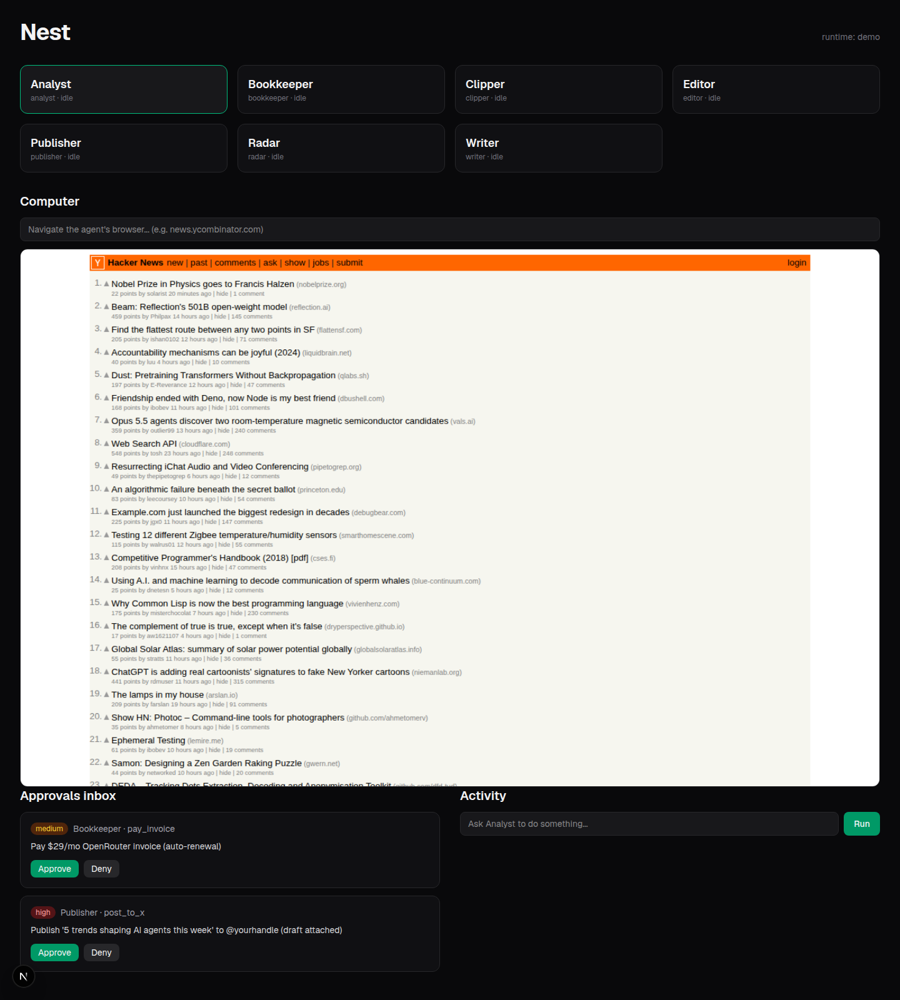

# Nest

> A colony of always-on AI agents that run your one-person content business. The open-source answer to Grok Bot, OpenAI Dots, and Meta Muse.

Free forever. MIT. Local-first. Your keys, your data, your agents.

## What it is

Nest is a web app + control plane for a team of persistent AI agents — a
researcher, writer, editor, clipper, publisher, analyst, and bookkeeper —
that work 24/7. Every risky action goes through a smart approvals inbox.
The agent loop is pluggable: **Hermes Agent** when installed, a demo loop
otherwise, so the UI works with zero setup.



## Quick start

```bash
# brain (control plane)
cd services/brain
python -m venv .venv && .venv/bin/pip install -r requirements.txt
.venv/bin/uvicorn app.main:app --port 8000

# web (in another terminal)
cd apps/web
bun install
bun dev
```

Open http://localhost:3000. The demo runtime answers without any API keys;
install [Hermes Agent](https://github.com/NousResearch/hermes-agent) and set a
model key to make agents real.

## Repo layout

```
apps/web            Next.js app (colony view, approvals inbox, activity feed)
services/brain      FastAPI control plane (agents, approvals, chat runs, SSE)
colonies/           starter colony templates
docs/               architecture notes
packages/protocol   shared event/agent protocol types
```

## Roadmap & architecture

See [plan.md](plan.md).

## License

MIT — see LICENSE. Not affiliated with xAI, OpenAI, or Meta.
